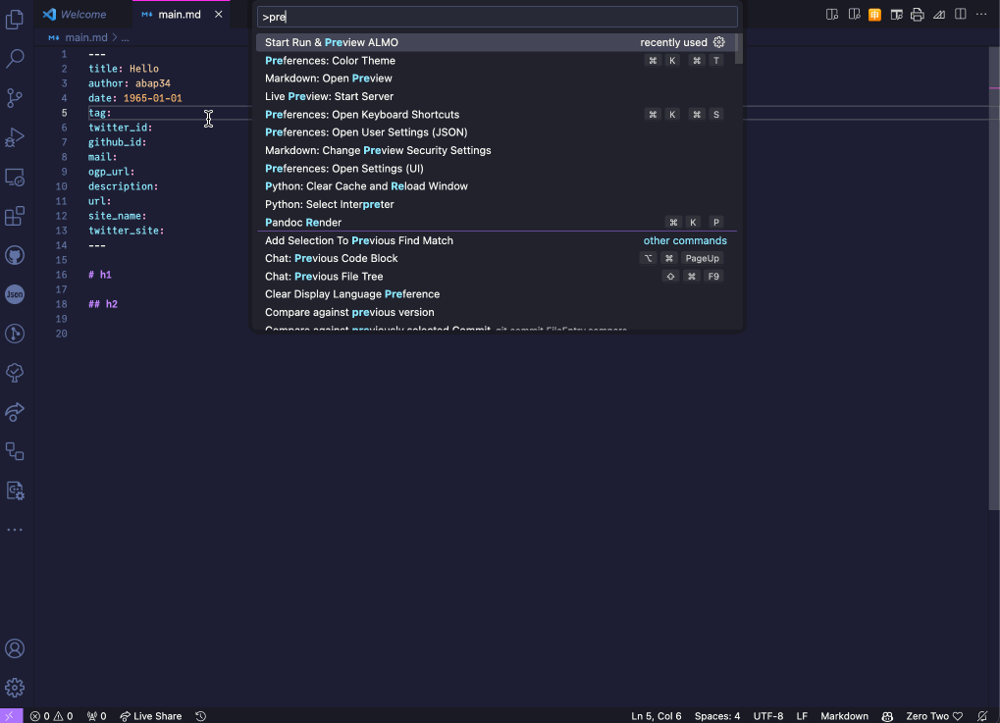

# ALMO-extension

Visual Studio Code Extention for [ALMO](https://github.com/abap34/ALMO) .

**⚠️ This extension is experimental phase.**

# Feature

`almo.preview`

現在開いている Markdownファイルのプレビューを新しいタブで表示します。

ファイルに対して編集を加えると、プレビューも自動で更新されます。

`settings.json` で `almo.css` の値を設定することで、利用するCSSファイルを指定することができます。

# Requirements  

- ALMO v0.5.3 or later
- `almo` command must be available in the PATH.

# Example

